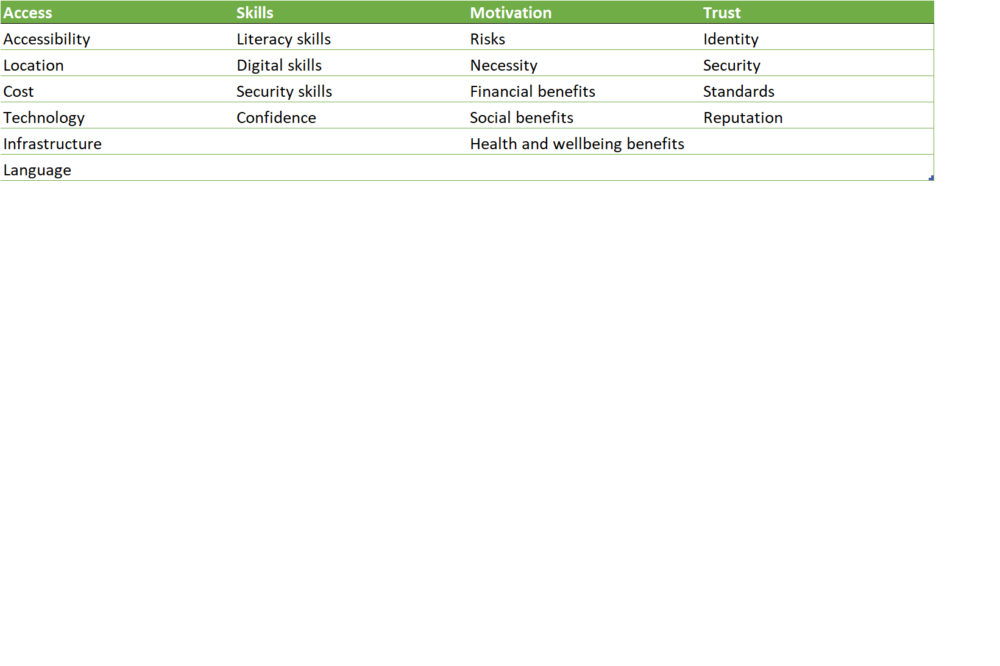

# Digital Inclusion

## Problems people suffer

## Access
### Accessibility

### Location

### Cost

### Technology

### Infrastructure

### Language

## Skills
### Literacy Skills

### Digital Skills

### Security Skills

### Confidence

## Motivation
### Risks

### Necessity

### Financial Benefits

### Social Benefits

### Health and wellbeing benefits

## Trust
### Identity

### Security

### Standards

### Reputation

## Resources
### Identity

### Security

### Standards

### Reputation
